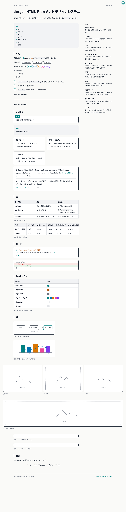
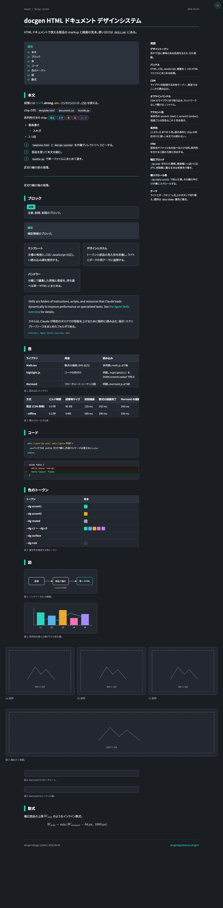

# docgen

テキストベースの成果物を作る Claude Code プラグイン。日本語の文章規範と、単一ファイル HTML の
デザインシステムを提供する。見た目の判断はデザインシステム側が済ませていて、書き手は `dg-` クラスを
当てるだけで一貫した文書になる。

## Skills

| Skill | Description |
|-------|-------------|
| [`explain`](skills/explain/SKILL.md) | 説明ドキュメントの構成 |
| [`writing`](skills/writing/SKILL.md) | 日本語の文章規範 |
| [`html`](skills/html/SKILL.md) | 単一ファイル HTML の作成・編集 |

## デザインシステム

部品の使い分けは [`html` の SKILL.md](skills/html/SKILL.md) にある。
全部品のマークアップの実例は [`component-samples.html`](skills/html/references/component-samples.html) にあり、
描画テストページでもある。実装の詳細と運用ルールは
[`DESIGN_SYSTEM.md`](skills/html/references/DESIGN_SYSTEM.md) にまとめてある。

|  |  |
| --- | --- |

## Scripts

| Script | 用途 |
|--------|------|
| `scripts/bundle.py` | HTML と `design-system/` を 1 ファイルにまとめる。標準ライブラリのみ |
| `scripts/screenshot.sh` | headless Chrome でライト / ダークの PNG を撮る |

```
bundle.py <input.html> -o <output.html>                          # CDN 参照のまま、数十 KB
bundle.py <input.html> -o <output.html> --offline --no-webfonts  # ネットワーク不要、約 6 MB
bundle.py <input.html> -o <output.html> --offline                # Web フォントも埋め込み、約 27 MB
screenshot.sh <input.html> [--dark] [--no-network] [--width N] [--height N] [-o <output.png>]
```

## Installation

```
/plugin install docgen@pokutuna-plugins
```

## Prior work

- [mathbullet/skills](https://github.com/mathbullet/skills/blob/main/plugins/html/skills/html/SKILL.md)（Hayate Funakura / `@mathbullet`）
  - skill、design-system を参考に `html` を実装
- [japanese-tech-writing/SKILL](https://gist.github.com/k16shikano/fd287c3133457c4fd8f5601d34aa817d)（Keiichiro Shikano / `@k16shikano`）
